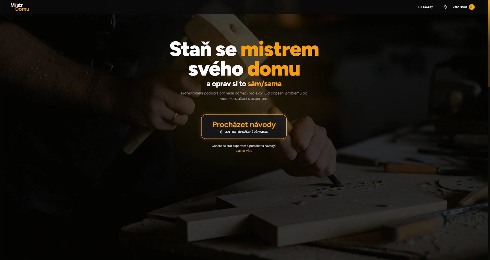
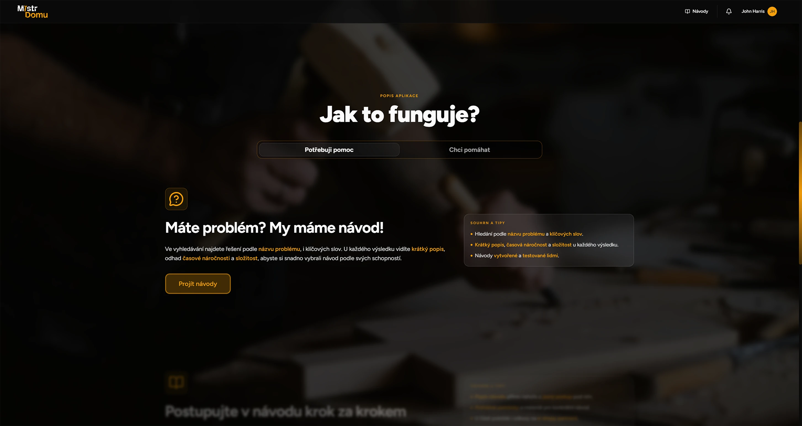
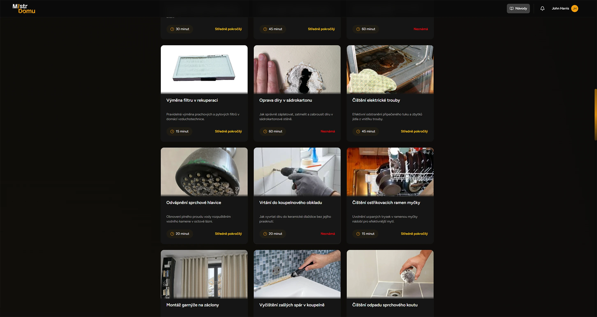
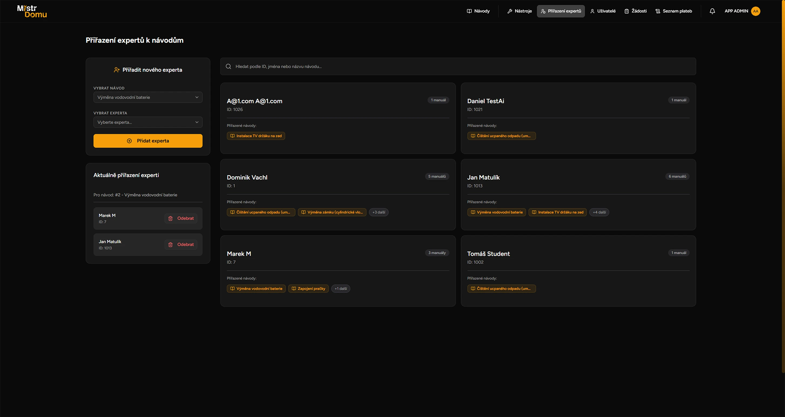

    

<!-- TODO: Bring the homepage or some image here -->

## Project Methodology & Development Lifecycle

This application was developed as a comprehensive academic project by a cross-functional team of five. The development process strictly adhered to **Agile methodologies**, managed entirely within **Azure DevOps**. The product lifecycle began with a Lean Canvas, evolved into an MVP planning board, and culminated in this fully-fledged platform. Development was structured around **weekly sprints** and **retrospectives** to continuously refine team velocity and code quality. A dedicated Product Owner (who also served as the Scrum Master) guided the project by defining user stories, prioritizing the backlog, and approving feature deliverables.

 

## Overview

Mistr Domu is a full-stack product that combines a **React 19** + Vite frontend, an **ASP.NET Core** backend, and a **PostgreSQL** database. It delivers interactive DIY manuals, AI-assisted guidance scoped to a single manual, real-time expert consultations, and an admin backoffice. The architecture is designed around clear separation of concerns: UI components and routing on the client, domain services and API controllers on the server, and a database model with migrations for reliable evolution.

#### Content Discovery & Interactive Guides

Users discover solutions through a **searchable library** of human-tested manuals. Manuals include practical data like short descriptions, estimated time complexity, and difficulty levels. Inside a guide, the UI offers a localized table of contents, a clear introduction, and a required tools list with affiliate links. Step-by-step instructions are interactive, persist completion state, and include zoomable images for detailed inspection.

#### Context-Bounded AI & Real-Time Telemetry

Each manual includes an **AI assistant** that is strictly scoped to the active manual content. The platform uses a freemium token model (2 free queries per manual) and unlocks unlimited queries for a specific guide through a one-time payment. If AI is insufficient, users can escalate to a live expert via embedded Daily API video calls.

#### The Expert Ecosystem

Experts onboard through a dedicated pipeline and can monetize their knowledge. They define which manuals they accept, manage online/offline presence, and use analytics dashboards to track calls, minutes, revenue, and withdrawals.

#### Admin Backoffice & Role-Based Access Control

Admins manage the full user lifecycle, approve expert applications, and assign experts to guides. The backoffice includes CRUD for manuals and tools and centralized oversight of payments and payouts.

## Technical Architecture

### Frontend (React + Vite)

- **React 19 + TypeScript:** Component driven UI with strong typing across pages, hooks, and domain models.
- **Routing & Auth Guards:** Protected routes and role-aware navigation for User, Expert, and Admin roles.
- **UI System:** Tailwind CSS with shadcn components, Base UI and Radix-based primitives.
- **State & Data:** Custom hooks for API interaction, user filters, manual data loading, and tab lifecycle handling.
- **AI Chat UX:** Clientside chat UI constrained to the current manual, with free/paid query gating.
- **SSE Notifications:** Heartbeat driven Server Sent Events for expert role approvals/denials and incoming call alerts.

### Backend (ASP.NET Core)

- **API-first design:** Controllers organized by feature areas (manuals, steps, tools, calls, identity, payments).
- **Services layer:** Abstraction/Implementation split for testability and clear dependency boundaries.
- **EF Core + Migrations:** Database model under `Models/`, `AppDbContext`, and a migration history.
- **RBAC & Policies:** Custom authorization handlers for admin/expert/self access rules.
- **Integrations:** Daily API for video calls, Stripe for payments, Google/OpenAI (model can be switched) Generative AI for manual-scoped assistance.
- **Background Work:** Email queue and cleanup workers for reliable notifications.
- **Email Notifications:** Automated system emails for role updates, calls, and platform events.

### Key Features (Technical)

- **Manual engine:** Nested steps, tool requirements, and media assets with per-user completion tracking.
- **AI assistant:** Strict prompt scoping to manual content, token gating, and interaction logging.
- **Expert marketplace:** Presence tracking, call sessions, and payout ledgering.
- **Admin tooling:** CRUD workflows for manuals, tools, roles, and financial data.

## Project Structure

### Client (AspNetReactTemplate.Client)

- **src/App.tsx, src/main.tsx:** React entrypoints and routing setup.
- **src/components/:** Feature oriented UI components (domains, layouts, shared, ui).
- **src/pages/:** Route-level screens (Home, Search, Guide, Admin, Expert flows).
- **src/contexts/, src/hooks/:** Auth and cross-cutting state, domain hooks.
- **src/lib/:** API service wrappers and shared utilities.
- **src/types/:** Frontend DTOs and domain types.
- **public/:** Client static assets and branding.
- **package.json:** React 19 + Vite + Tailwind + toolchain configuration.

### Server (AspNetReactTemplate.Server)

- **Program.cs:** Application bootstrap and middleware wiring.
- **Controllers/:** REST API endpoints grouped by domain (manuals, steps, tools, identity, calls, payments).
- **Services/Abstraction, Services/Implementation:** Service interfaces and concrete implementations.
- **Data/AppDbContext.cs:** EF Core context and DB configuration.
- **Migrations/:** Schema history for reproducible database evolution.
- **Models/:** Entities and DTOs (manuals, identity, payments, notifications).
- **Infrastracture/Identity:** Authorization policies and handlers.
- **Extensions/:** Service registration and controller helpers.

## Screens

> Note: This section is in progress and will be expanded with more screenshots and descriptions of key UI flows. The current images are placeholders to illustrate the general design direction and layout of the application.

<!-- TODO: Make these into a grid or something, right now they are too big -->

### Home Page

### How It Works Section

### Search Page

### Admin's Expert Management Page

## License

This project is proprietary and confidential. All rights reserved.
See the [LICENSE](LICENSE) file for details.
